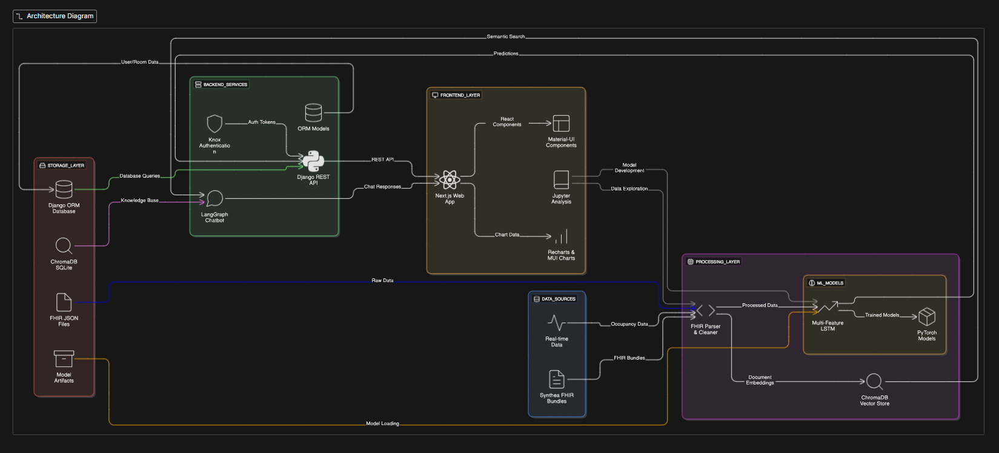

# HospitalIQ 🏥

**DevHub@iLab's SummerBuild 2025 Project**

HospitalIQ is a comprehensive hospital management system that combines intelligent patient flow prediction, room allocation optimization, and AI-powered medical assistance. Built with modern web technologies and machine learning capabilities.


## 🌟 Features

### 🤖 AI-Powered Medical Chatbot
- **LangGraph-based Conversational AI** with conditional database querying
- **Smart Query Routing** - automatically determines whether to access database or provide general responses
- **Vector Search Integration** for medical skills and specialties
- **DateTime Awareness** - provides current time/date information
- **Database Integration** with medical staff and skills data

### 📊 Patient Flow Prediction
- **LSTM Machine Learning Model** for predicting patient admission patterns
- **Multi-feature Time Series Analysis** with cyclical encoding (hourly, daily patterns)
- **24-hour Forecast Horizon** for capacity planning
- **Flask API** for real-time predictions

### 🏨 Hospital Management Dashboard
- **Real-time Room Availability** with interactive floor plans
- **Patient Entry Management** with severity classification
- **Room Assignment System** with visual grid interface
- **Patient Database** with full CRUD operations
- **IoT Integration** for alerts and monitoring

### 🎯 Key Management Functions
- **Patient Allocation** - Assign patients to available rooms
- **Capacity Planning** - Predict and manage hospital capacity
- **Staff Management** - Track medical staff specialties and skills
- **Real-time Monitoring** - Dashboard with KPIs and alerts

## 🏗️ Architecture

```
HospitalIQ/
├── backend/              # Django REST API
│   ├── chatbot/         # AI Chatbot with LangGraph
│   ├── users/           # Patient & Staff Management
│   └── hospitaliq/      # Main Django App
├── frontend/            # Next.js React Application
│   └── hospitaliq/      # Modern UI with Material-UI
├── notebooks/           # ML Development & Analysis
│   ├── model.py         # LSTM Model Architecture
│   ├── app.py           # Flask Prediction API
│   └── *.ipynb          # Jupyter Notebooks
└── output/              # Generated Data (FHIR, Metadata)
```


## 🚀 Tech Stack

### Backend
- **Django 5.2.3** - REST API framework
- **Django REST Framework** - API development
- **Knox Authentication** - Token-based auth
- **SQLite** - Database (doctors.db for chatbot)
- **CORS Headers** - Cross-origin support

### AI & Machine Learning
- **LangChain & LangGraph** - AI orchestration framework
- **OpenAI GPT-4o-mini** - Language model
- **ChromaDB** - Vector database for embeddings
- **PyTorch** - Deep learning framework
- **Scikit-learn** - ML utilities
- **LSTM Networks** - Time series prediction

### Frontend
- **Next.js 15.3.3** - React framework with App Router
- **Material-UI (MUI)** - Component library
- **TanStack Query** - Data fetching and caching
- **Axios** - HTTP client
- **TypeScript** - Type safety
- **Tailwind CSS** - Utility-first CSS

### Data Science
- **Jupyter Notebooks** - Analysis and development
- **Pandas & NumPy** - Data manipulation
- **Flask** - ML model serving
- **Pickle** - Model serialization

## 📦 Installation

### Prerequisites
- Python 3.11+
- Node.js 18+
- OpenAI API Key

### Backend Setup
1. **Clone and navigate to backend**
   ```bash
   cd backend
   ```

2. **Create virtual environment**
   ```bash
   python -m venv .venv
   .venv\Scripts\activate  # Windows
   source .venv/bin/activate  # macOS/Linux
   ```

3. **Install dependencies**
   ```bash
   pip install -r requirement.txt
   ```

4. **Environment setup**
   ```bash
   # Create .env file with your OpenAI API key
   echo "OPENAI_API_KEY=your_openai_api_key" > .env
   ```

5. **Database setup**
   ```bash
   python manage.py migrate
   python manage.py createsuperuser
   ```

6. **Run Django server**
   ```bash
   python manage.py runserver
   ```

### Frontend Setup
1. **Navigate to frontend**
   ```bash
   cd frontend/hospitaliq
   ```

2. **Install dependencies**
   ```bash
   npm install
   ```

3. **Environment setup**
   ```bash
   # Create .env.local
   echo "NEXT_PUBLIC_BACKEND_URL=http://localhost:8000" > .env.local
   ```

4. **Run development server**
   ```bash
   npm run dev
   ```

### ML Model Setup
1. **Navigate to notebooks**
   ```bash
   cd notebooks
   ```

2. **Run Flask prediction API**
   ```bash
   python app.py
   ```

## 🎮 Usage

### Access Points
- **Frontend Dashboard**: http://localhost:3000
- **Backend API**: http://localhost:8000
- **ML Prediction API**: http://localhost:5000
- **Django Admin**: http://localhost:8000/admin

### User Roles
1. **Medical Staff** - Full dashboard access with patient management
2. **General Users** - Chatbot access only

### Key Workflows

#### 1. Patient Management
1. Add new patients via dashboard
2. Create patient entries with severity levels
3. Assign rooms using interactive floor plan
4. Monitor patient status and room availability

#### 2. AI Chatbot Interaction
1. Access chatbot interface
2. Ask questions about:
   - Medical staff information
   - Hospital specialties
   - Current date/time
   - General medical knowledge
3. Get intelligent responses with database integration

#### 3. Capacity Prediction
1. Send POST request to `/api/predict` with current patient count
2. Receive 24-hour admission forecast
3. Use predictions for capacity planning

## 🧪 Testing

### Chatbot Testing
```bash
cd backend/chatbot
python test_datetime_tools.py
python test_datetime_chatbot.py
python enhanced_test.py
```

### Interactive Chatbot Demo
```bash
cd backend/chatbot
python langgraph_chatbot.py
```

## 📊 API Endpoints

### Authentication
- `POST /api/auth/login/` - User login
- `POST /api/auth/logout/` - User logout

### Patient Management
- `GET/POST /patient/` - List/Create patients
- `GET/PUT/DELETE /patient/{id}/` - Patient CRUD
- `GET/POST /patient_entry/` - Patient entries
- `POST /patient_entry/{id}/assign_room/` - Room assignment

### Room Management
- `GET /room/availability/` - Floor availability
- `GET /room/floor/{floor}/` - Rooms by floor

### Chatbot
- `POST /chatbot/chatbot/` - Chat with AI assistant

### ML Prediction
- `POST /api/predict` - Get patient admission forecast

## 🗃️ Database Schema

### Key Models
- **Patient** - Patient information (name, DOB, etc.)
- **PatientEntry** - Hospital admissions with severity
- **Room** - Hospital rooms with capacity and occupancy
- **User** - Staff and user accounts
- **Doctor** - Medical staff with specialties (chatbot DB)
- **Skills** - Medical skills database (chatbot DB)

## 🔧 Configuration

### Environment Variables
```bash
# Backend (.env)
OPENAI_API_KEY=your_openai_api_key
SECRET_KEY=your_django_secret_key

# Frontend (.env.local)
NEXT_PUBLIC_BACKEND_URL=http://localhost:8000
```

### Model Configuration
- **LSTM Model**: 64 hidden units, 24-hour horizon
- **Vector Store**: ChromaDB with text-embedding-3-small
- **Chat Model**: GPT-4o-mini for cost efficiency

## 🤝 Contributing

1. Fork the repository
2. Create feature branch (`git checkout -b feature/amazing-feature`)
3. Commit changes (`git commit -m 'Add amazing feature'`)
4. Push to branch (`git push origin feature/amazing-feature`)
5. Open Pull Request

## 📈 Future Enhancements

### Planned Features
- **Real-time IoT Integration** for medical devices
- **Advanced Analytics Dashboard** with predictive insights
- **Mobile Application** for on-the-go access
- **Integration with Hospital Information Systems**
- **Multi-language Chatbot Support**
- **Advanced ML Models** for outcome prediction

### Technical Improvements
- **Containerization** with Docker
- **Cloud Deployment** (Azure/AWS)
- **Performance Optimization** for large datasets
- **Enhanced Security** with OAuth2
- **Real-time Notifications** with WebSockets

## 📄 License

This project is licensed under the MIT License - see the [LICENSE](LICENSE) file for details.

## 🎯 Project Context

**SummerBuild 2025** - DevHub@iLab
- **Duration**: Summer 2025 Development Program
- **Focus**: Healthcare Technology Innovation
- **Team**: Student developers and researchers
- **Goal**: Create practical solutions for hospital management

## 📞 Support

For questions and support:
- **Project Issues**: Use GitHub Issues
- **Documentation**: Check inline code comments
- **Development**: Follow setup instructions above

---

**Built with ❤️ by summerCubs**

*Revolutionizing hospital management through AI and modern web technologies*